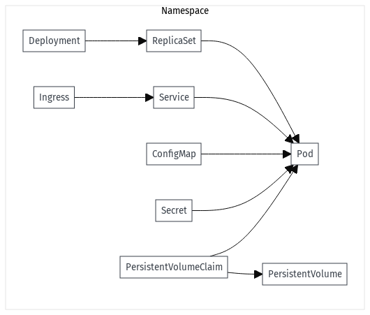

# k8s demystified



## Pré-requis

* https://kubernetes.io/docs/tasks/tools/
* https://helm.sh/docs/helm/helm_install/
* https://github.com/helmfile/helmfile
* https://k9scli.io/topics/install/
* https://github.com/mkimuram/k8sviz
* https://kompose.io/


## Minikube addons

```bash
minikube addons list

|-----------------------------|----------|--------------|--------------------------------|
|         ADDON NAME          | PROFILE  |    STATUS    |           MAINTAINER           |
|-----------------------------|----------|--------------|--------------------------------|
| ambassador                  | minikube | disabled     | 3rd party (Ambassador)         |
| auto-pause                  | minikube | disabled     | minikube                       |
| cloud-spanner               | minikube | disabled     | Google                         |
| csi-hostpath-driver         | minikube | disabled     | Kubernetes                     |
| dashboard                   | minikube | disabled     | Kubernetes                     |
| default-storageclass        | minikube | enabled ✅   | Kubernetes                     |
| efk                         | minikube | disabled     | 3rd party (Elastic)            |
| freshpod                    | minikube | disabled     | Google                         |
| gcp-auth                    | minikube | disabled     | Google                         |
| gvisor                      | minikube | disabled     | minikube                       |
| headlamp                    | minikube | disabled     | 3rd party (kinvolk.io)         |
| helm-tiller                 | minikube | disabled     | 3rd party (Helm)               |
| inaccel                     | minikube | disabled     | 3rd party (InAccel             |
|                             |          |              | [info@inaccel.com])            |
| ingress                     | minikube | disabled     | Kubernetes                     |
| ingress-dns                 | minikube | disabled     | minikube                       |
| inspektor-gadget            | minikube | disabled     | 3rd party                      |
|                             |          |              | (inspektor-gadget.io)          |
| istio                       | minikube | disabled     | 3rd party (Istio)              |
| istio-provisioner           | minikube | disabled     | 3rd party (Istio)              |
| kong                        | minikube | disabled     | 3rd party (Kong HQ)            |
| kubeflow                    | minikube | disabled     | 3rd party                      |
| kubevirt                    | minikube | disabled     | 3rd party (KubeVirt)           |
| logviewer                   | minikube | disabled     | 3rd party (unknown)            |
| metallb                     | minikube | disabled     | 3rd party (MetalLB)            |
| metrics-server              | minikube | disabled     | Kubernetes                     |
| nvidia-device-plugin        | minikube | disabled     | 3rd party (NVIDIA)             |
| nvidia-driver-installer     | minikube | disabled     | 3rd party (NVIDIA)             |
| nvidia-gpu-device-plugin    | minikube | disabled     | 3rd party (NVIDIA)             |
| olm                         | minikube | disabled     | 3rd party (Operator Framework) |
| pod-security-policy         | minikube | disabled     | 3rd party (unknown)            |
| portainer                   | minikube | disabled     | 3rd party (Portainer.io)       |
| registry                    | minikube | disabled     | minikube                       |
| registry-aliases            | minikube | disabled     | 3rd party (unknown)            |
| registry-creds              | minikube | disabled     | 3rd party (UPMC Enterprises)   |
| storage-provisioner         | minikube | enabled ✅   | minikube                       |
| storage-provisioner-gluster | minikube | disabled     | 3rd party (Gluster)            |
| storage-provisioner-rancher | minikube | disabled     | 3rd party (Rancher)            |
| volcano                     | minikube | disabled     | third-party (volcano)          |
| volumesnapshots             | minikube | disabled     | Kubernetes                     |
| yakd                        | minikube | disabled     | 3rd party (marcnuri.com)       |
|-----------------------------|----------|--------------|--------------------------------|
```

## Routage static

```bash
minikube addons enable ingress

minikube ip

192.168.49.2

sudo vi /etc/hosts

127.0.0.1       localhost
192.168.49.2    docs.k8s.local
```

## Routage dynamique

```bash
minikube addons enable ingress
minikube addons enable ingress-dns

sudo vi /etc/resolv.conf 

nameserver 127.0.0.53
options edns0 trust-ad
search .

nameserver 192.168.49.2
search k8s.local
```

## Minikube versionning k8s

```bash
minikube start --kubernetes-version=v1.15.0
```


## Minikube multi-nodes avec profil

```bash
export K8S_PROFILE=multinode-demo

minikube start --nodes 3 -p $K8S_PROFILE --cpus 3 --memory 3072

minikube ip -p $K8S_PROFILE

minikube stop -p $K8S_PROFILE

minikube delete -p $K8S_PROFILE
```

## Présentation

* [Principes de base](./k8s/principes.md)
* [Compose vs Pod](./k8s/compose-vs-pod.md)
* [Les gestion des volumes](./k8s/volumes.md)
* [Liste des ressources K8s](./k8s/ressources.md)

## Pratique

* [Travaux pratique](./k8s/pratique.md)
* [Helm](/k8s/helm.md)
