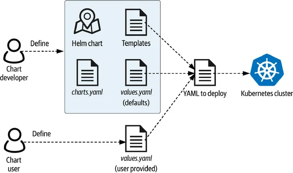

# Helm




Helm est un outil de gestion de packages pour Kubernetes qui simplifie le déploiement, la mise à jour et la gestion d’applications dans le cluster. Helm utilise des packages appelés Charts pour regrouper toutes les ressources Kubernetes nécessaires pour une application ou un service, facilitant leur installation et leur maintenance.

## 1. Principaux concepts de Helm

* **Charts** : Un chart est un package Helm qui contient les fichiers nécessaires au déploiement d'une application sur Kubernetes, incluant les manifests Kubernetes, des modèles (templates) et des valeurs de configuration par défaut.
* **Release** : Une release est une instance spécifique d'un chart déployé dans un cluster Kubernetes. Cela permet d’avoir plusieurs instances (versions) d'une même application, chacune avec ses propres paramètres.
* **Repository** : Helm possède un écosystème de dépôts publics où les charts sont stockés, comme le dépôt officiel Helm (Helm Hub). Les utilisateurs peuvent également créer leurs dépôts privés pour gérer leurs propres charts.

## 2. Fonctionnalités principales de Helm

* **Déploiement simplifié** : Helm permet de déployer une application avec une seule commande (helm install), au lieu de gérer chaque ressource Kubernetes séparément.
* **Configuration flexible** : Grâce aux templates et à un fichier de valeurs, Helm permet de personnaliser facilement les paramètres d'une application, tels que le nombre de réplicas, les limites de ressources, les configurations de réseaux, etc.
* **Mises à jour et rollbacks** : Helm facilite la mise à jour des applications (helm upgrade) et le retour en arrière vers une version précédente (helm rollback) en cas de besoin.
* **Gestion des dépendances** : Les charts Helm peuvent définir des dépendances entre plusieurs applications ou services, assurant que toutes les ressources nécessaires sont installées dans le bon ordre.


Exemple d’utilisation

Pour installer une application avec Helm, il suffit d’utiliser la commande :

```bash
helm install my-release-mysql stable/mysql
```

Dans cet exemple, un chart mysql du dépôt stable est installé avec une release nommée my-release.

## Avantages de Helm

* **Standardisation des déploiements** : Simplifie le déploiement et la maintenance des applications en centralisant la configuration et en rendant les déploiements reproductibles.
* **Réutilisation** : Les charts permettent de réutiliser des configurations complexes pour des déploiements similaires.
* **Communauté et écosystème riche** : Helm dispose de nombreux charts publics, facilitant le déploiement d’applications populaires (bases de données, outils de monitoring, etc.).


Helm est souvent comparé à un "gestionnaire de paquets pour Kubernetes", ce qui en fait un outil clé pour les équipes qui cherchent à industrialiser et simplifier leurs déploiements Kubernetes.


## Exemple 

Création d'un namespace exemple

```bash
export NAMESPACE=demo-helm

kubectl create ns $NAMESPACE
```

Voici comment installer une application avec une version spécifique d'un chart depuis un dépôt Helm distant. Supposons que vous souhaitez installer une base de données MySQL avec une version de chart particulière.

1. Ajouter le dépôt Helm distant (si ce n'est pas déjà fait). Par exemple, nous allons utiliser le dépôt stable de Helm qui contient divers charts d'applications, y compris MySQL.

```bash
helm repo add stable https://charts.helm.sh/stable
```

2. Mettre à jour les dépôts Helm pour s'assurer que vous avez la liste des versions de charts à jour.


```bash
helm repo update
```

3. Lister les versions disponibles d'un chart (par exemple mysql). Cela vous aidera à voir toutes les versions du chart et à sélectionner celle qui convient.

```bash
helm search repo stable/mysql --versions
```

Cette commande affichera toutes les versions disponibles du chart MySQL dans le dépôt stable.


4. Installer une version spécifique du chart. Supposons que vous souhaitez installer la version 1.6.9 du chart mysql.

```bash
helm install my-release stable/mysql --version 1.6.9 -n $NAMESPACE
```

Dans cet exemple :

* **my-release** est le nom de la release de votre application, qui vous permet de suivre cette installation.
* **stable/mysql** spécifie le chart MySQL du dépôt stable.
* **--version 1.6.9** précise la version du chart à installer.

5. Vérifier l'installation en utilisant la commande suivante :

```bash
helm list -n $NAMESPACE
```

Cela affichera toutes les releases installées dans le cluster, y compris my-release, avec les informations relatives au chart et à la version.


### Exemple complet

```bash
export NAMESPACE=demo-helm
kubectl create ns $NAMESPACE

helm repo add stable https://charts.helm.sh/stable
helm repo update
helm search repo stable/mysql --versions
helm install my-release stable/mysql --version 1.6.8 -n $NAMESPACE
```

### Points à noter

* La version du chart ne correspond pas nécessairement à la version de l'application (comme MySQL), mais à la version du package Helm, qui peut inclure des mises à jour ou corrections de configuration indépendantes de l'application elle-même.
* En cas de besoin de mise à jour, vous pouvez facilement passer à une autre version du chart en utilisant : 

```bash
helm upgrade my-release stable/mysql --version 1.6.9 -n $NAMESPACE
```


### Utilisation réelle

```bash
export NAMESPACE=demo-helm
kubectl create ns $NAMESPACE

# Récupération du values par défaut du helm
cd ./helm/values
helm show values stable/mysql --version 1.6.9 > mysql.values-1.6.9.yaml

# --set foo=bar --set foo=newbar
helm install my-release stable/mysql --version 1.6.9 -n $NAMESPACE -f mysql.values-1.6.9.yaml
```

## Helm charts demo 

### Pré-requis

* [Installation Nexus](../helm/nexus/README.md)

### Création d'un chart personnalisé

```bash
cd ./helm/charts
helm create my-chart-demo

# Génération des charts
cd ..

helm lint ./charts/*

helm package ./charts/* --destination ./generated
```

# Publication dans un dépôt de helm hosted

```bash
# Repository url
export REPO_URL=http://localhost:8081
# ou bien
export REPO_URL=https://repo.demo.local


cd ./helm/generated

# Upload by HTTP POST
curl -u admin:admin $REPO_URL/repository/helm-hosted/ --upload-file my-chart-demo-0.1.0.tgz -v -k

# Using Helm Client
helm repo add helm-hosted --insecure-skip-tls-verify $REPO_URL/repository/helm-hosted/ --username admin --password admin
helm repo add helm-proxy --insecure-skip-tls-verify $REPO_URL/repository/helm-proxy/ --username admin --password admin

# Search in helm-hosted
helm search repo helm-hosted

helm search repo helm-hosted/my-chart-demo --versions

# Search in helm-proxy
helm search repo helm-proxy
```


```bash
helm show values helm-hosted/my-chart-demo --version 0.1.0 > my-chart-demo-values-0.1.0.yaml
helm show values helm-hosted/my-chart-demo --version 0.2.0 > my-chart-demo-values-0.2.0.yaml
```


```bash
helm repo update
helm search repo helm-hosted/my-chart-demo --versions


export NAMESPACE=demo-helm
kubectl create ns $NAMESPACE

helm install my-release-01 helm-hosted/my-chart-demo --version 0.1.0 -n $NAMESPACE 

helm install my-release-02 helm-hosted/my-chart-demo --version 0.1.0 -n $NAMESPACE -f my-chart-demo-values-0.1.0.yaml
 
helm upgrade my-release-02 helm-hosted/my-chart-demo --version 0.1.0 -n $NAMESPACE -f my-chart-demo-values-0.1.0.yaml

helm delete my-release-02 -n $NAMESPACE
```