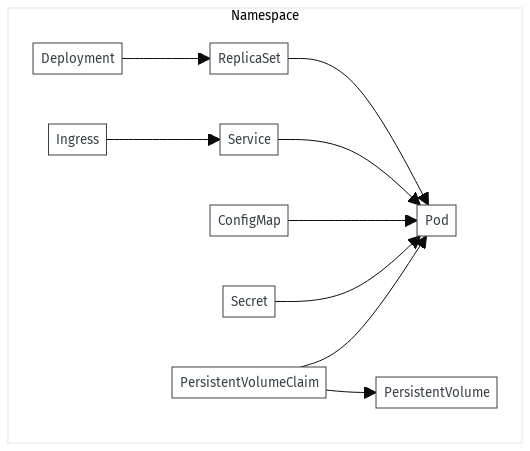

# Kubernetes


## Contexte de l’émergence de Kubernetes

Kubernetes a été développé pour répondre aux limitations de Docker Compose et Docker Swarm, notamment pour orchestrer des conteneurs à grande échelle et gérer des applications complexes en production. Kubernetes, inspiré de l’expérience de Google avec Borg, offre une robustesse et une flexibilité qui permettent de déployer des applications conteneurisées en toute résilience, en assurant la haute disponibilité, la scalabilité, et la portabilité entre différents environnements de cloud.


## Docker Compose

### docker-compose.yaml : 

C'est un fichier conçu pour orchestrer des conteneurs Docker sur un seul hôte. Il est surtout adapté pour les environnements de développement et les petites applications.


```yaml
# La version de Docker Compose utilisée (par exemple, "3.8").
version: "3.8"

# Définit les conteneurs individuels (similaire à des "pods" en Kubernetes).
services:
  web:
    # Image Docker utilisée pour le conteneur.
    image: nginx:latest
    # Définition des ports (par exemple, 8080:80 pour exposer le port 80 du conteneur sur le port 8080 de l’hôte).
    ports:
      - "8080:80"
    # Variables d'environnement passées au conteneur.
    environment:
      - NGINX_HOST=localhost
      - NGINX_PORT=80
    # Définition des volumes pour le stockage persistant.
    volumes:
      - ./html:/usr/share/nginx/html
    # Définition des réseaux pour interconnecter les services.
    networks:
      - webnet

  db:
    image: postgres:latest
    environment:
      - POSTGRES_DB=mydb
      - POSTGRES_USER=user
      - POSTGRES_PASSWORD=password
    volumes:
      - pgdata:/var/lib/postgresql/data
    networks:
      - webnet

# Définition des volumes pour la persistance des données partagée entre les conteneurs.
volumes:
  pgdata:

# Définition des réseaux de communication entre conteneurs.
networks:
  webnet:

```

## K8s

### deployment.yaml (Kubernetes) : 

Utilisé pour orchestrer et gérer des conteneurs sur un cluster de plusieurs nœuds, conçu pour la scalabilité et la résilience en production.


```yaml
# Version de l'API Kubernetes (par exemple, apps/v1).
apiVersion: apps/v1
# Type de ressource Kubernetes (par exemple, Deployment pour une application déployée).
kind: Deployment
# Métadonnées pour identifier le déploiement (nom, labels, etc.).
metadata:
  name: web-deployment
# Spécifications de la ressource.
spec:
  # Nombre de pods répliqués pour assurer la disponibilité.
  replicas: 2
  # Critères de sélection pour les pods.
  selector:
    matchLabels:
      app: web
  # Modèle de pod, similaire aux services Docker Compose.
  template:
    metadata:
      labels:
        app: web
    spec:
      # Configuration des conteneurs.
      containers:
      - name: web
        # Image Docker.
        image: nginx:latest
        # Ports exposés par les conteneurs.
        ports:
        - containerPort: 80
        # Variables d'environnement pour les conteneurs.
        env:
        - name: NGINX_HOST
          value: "localhost"
        - name: NGINX_PORT
          value: "80"
        # cf resources paragraph
        resources:
          limits:
            memory: "256Mi"
            cpu: "500m"
          requests:
            memory: "128Mi"
            cpu: "250m"          
        # Points de montage pour les volumes (similaire aux volumes de Docker Compose).
        volumeMounts:
        - mountPath: /usr/share/nginx/html
          name: html-volume
      # Définition des volumes pour la persistance.
      volumes:
      - name: html-volume
        emptyDir: {}  # Peut être remplacé par une configuration de volume persistant si nécessaire

```

Le Deployment:

* Définit deux réplicas (replicas: 2) pour assurer la haute disponibilité.
* Le conteneur utilise l'image nginx:latest et expose le port 80.
* Un volume est monté pour stocker les fichiers statiques de l'application.
* Les variables d’environnement sont configurées de manière similaire à Docker Compose.


### service.yaml (Kubernetes) :

Expose des Pods pour permettre l'accès au réseau, au sein du cluster (ClusterIP), ou en externe (NodePort, LoadBalancer).

```yaml
apiVersion: v1
kind: Service
metadata:
  name: web-service
spec:
  selector:
    app: web
  ports:
    - protocol: TCP
      port: 80
      targetPort: 80
  type: LoadBalancer
```

Le Service :

* Définit un service de type LoadBalancer pour exposer l'application au monde extérieur, idéal pour les clusters dans des environnements cloud.
* selector: app: web associe ce service aux pods créés par le Deployment en utilisant l’étiquette app: web.


## Principales Différences

* **Déploiement** : Docker Compose déploie les conteneurs sur un seul hôte, alors que Kubernetes orchestre les conteneurs à l’échelle du cluster.
* **Scalabilité** : Kubernetes permet de scaler facilement les applications avec le paramètre replicas, et il gère automatiquement la haute disponibilité et le redémarrage des pods défaillants.
* **Gestion des ressources** : Kubernetes offre un contrôle fin sur la gestion des ressources (CPU, RAM) pour chaque conteneur.
* **Auto-réparation et mise à jour continue** : Kubernetes peut redémarrer automatiquement les conteneurs défaillants et permettre des mises à jour progressives avec les RollingUpdates.
* **Réseaux et services** : Kubernetes gère la mise en réseau et l'exposition des services de manière plus avancée avec des concepts comme les Services et les Ingress, permettant la gestion du trafic entre services à grande échelle.


## Resources

Dans un fichier deployment.yaml pour Kubernetes, la section resources permet de définir les **limites** et les **demandes (requests)** de ressources pour chaque conteneur au sein d’un pod. Ces valeurs spécifient la quantité de mémoire et de CPU que le conteneur peut utiliser, permettant ainsi de gérer efficacement les ressources du cluster.

```yaml
    resources:
      limits:
        memory: "256Mi"
        cpu: "500m"
      requests:
        memory: "128Mi"
        cpu: "250m" 
```


Voici comment expliquer chaque partie de cette section :

### 1. resources

La clé resources regroupe les **limites** (limits) et les **demandes** (requests) de ressources allouées pour le conteneur. Cela aide Kubernetes à gérer les ressources en fixant des limites maximales et en réservant des ressources minimales nécessaires pour le conteneur.

### 2. limits

**limits** définit la **quantité maximale** de ressources (CPU et mémoire) qu’un conteneur peut utiliser. Si le conteneur tente de dépasser cette limite, Kubernetes va limiter son utilisation :

- **memory**: 256Mi — Limite de 256 MiB de mémoire. Si le conteneur essaie d’utiliser plus de mémoire que cette limite, il risque d’être arrêté par Kubernetes pour éviter la surutilisation.

- **cpu**: 500m — Limite de 500 milliCPU, soit 0,5 CPU (ou 50 % d’un CPU). Le conteneur ne pourra pas utiliser plus de 50 % d’un CPU complet.

### 3. requests

**requests** indique la quantité minimale de ressources que Kubernetes alloue au conteneur. Le conteneur est garanti de disposer de cette quantité :
    
- **memory**: 128Mi — Demande minimale de 128 MiB de mémoire. Kubernetes s’assure qu’au moins cette quantité de mémoire est disponible avant de programmer ce conteneur.

- **cpu**: 250m — Demande minimale de 250 milliCPU, soit 0,25 CPU (ou 25 % d’un CPU). Cela garantit que le conteneur aura au moins cette quantité de CPU disponible pour s'exécuter.


En résumé, requests correspond aux ressources minimales réservées pour le bon fonctionnement du conteneur, tandis que limits fixe une limite au-delà de laquelle Kubernetes restreint l'utilisation du conteneur pour préserver la stabilité du cluster.

## Kubernetes

Ce schéma montre les relations principales entre les ressources : le lien entre **Deployments**, **ReplicaSets**, **Pods**, et les ressources comme **Services**, **Ingress**, et **PersistentVolumes** pour le stockage.




- **Pod** : Le plus petit objet de déploiement de Kubernetes, contenant un ou plusieurs conteneurs.
- **ReplicaSet** : Assure qu’un nombre spécifié de Pods est en cours d'exécution à tout moment.
- **Deployment** : Contrôle les ReplicaSets pour gérer les versions de Pods.
- **Service** : Expose un ou plusieurs Pods et les rend accessibles à d'autres services ou à l'extérieur du cluster.
- **Ingress** : Gère les accès externes au cluster (HTTP et HTTPS).
- **ConfigMap et Secret** : Fournissent des configurations ou informations sensibles aux applications.
- **PersistentVolumeClaim (PVC) et PersistentVolume (PV)** : Gèrent le stockage des données.
- **Namespace** : Cloisonne les ressources pour les gérer indépendamment dans Kubernetes.

Les liens importants entre ces ressources sont les suivants :

- Un **Deployment** gère un **ReplicaSet** qui gère un ou plusieurs **Pods**.
- Un **Service** se connecte aux **Pods** pour permettre l'accès au sein du cluster.
- Les **Ingress** dirigent le trafic externe vers un **Service**.
- Les **ConfigMaps et Secrets** sont montés dans les **Pods** pour fournir des configurations.
- Les **PersistentVolumeClaims** sont montés dans les **Pods** pour fournir un stockage persistant.


## Accès au service

Dans Kubernetes, le nommage des URL d'accès aux services au sein d'un namespace suit généralement la structure suivante pour garantir la résolution DNS interne du cluster :

```php
<service-name>.<namespace>.svc.cluster.local
```

### Explication de la nomenclature

* **service-name** : nom du service défini dans le manifest Kubernetes (Service).

* **namespace** : nom du namespace où le service est déployé.

* **svc** : sous-domaine réservé pour les services internes au cluster.

* **cluster.local** : domaine de niveau supérieur pour le réseau interne du cluster.


### Exemple d'URL interne

Pour un service nommé **my-service** dans un namespace nommé **production**, l'URL d'accès au service serait :

```lua
my-service.production.svc.cluster.local
```


### Cas d'usage

* **Accès intra-namespace** : Depuis un Pod dans le même namespace, on peut simplement utiliser **service-name**, par exemple my-service.

* **Accès inter-namespace** : Depuis un Pod dans un autre namespace, l'URL complète **service-name**.**namespace**.svc.cluster.local est requise.


### Note sur l'Ingress

Les **Ingress** sont utilisés pour exposer des services en dehors du cluster. Dans ce cas, les URL d'accès peuvent être définies par des noms de domaine externes personnalisés ou IP, en fonction de la configuration du contrôleur Ingress.


